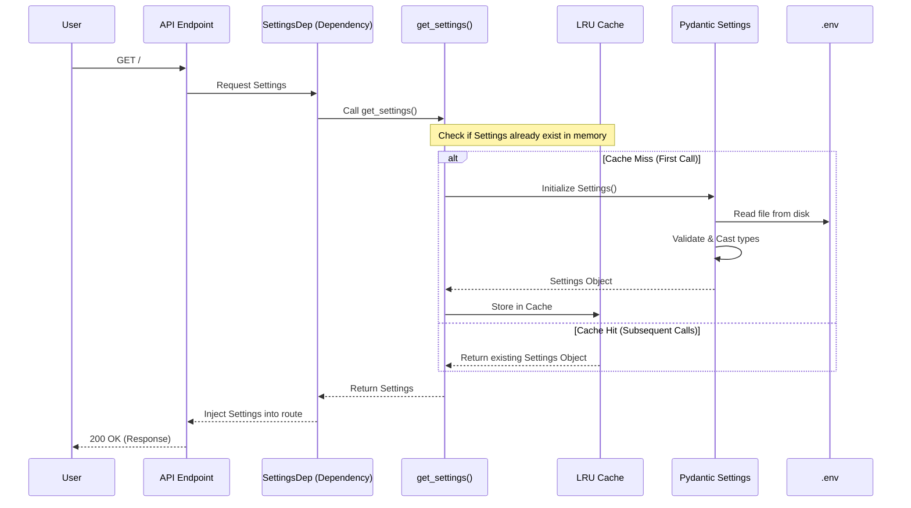

# Skeleton Fast API App
The intention behind writing this app as to use it a base for further development.

## Configuration
The app reads configuration values from _.env_ file. However, that file will not be shared in the git repository instead an equivalent example file _.env.example_ will be provided.  
### Setting up the .env file
```bash
# In your project root
cp .env.example .env

# Edit with your values
nano .env
```

### Sequence diagram for reading _settings_ with respect to root api **/**
